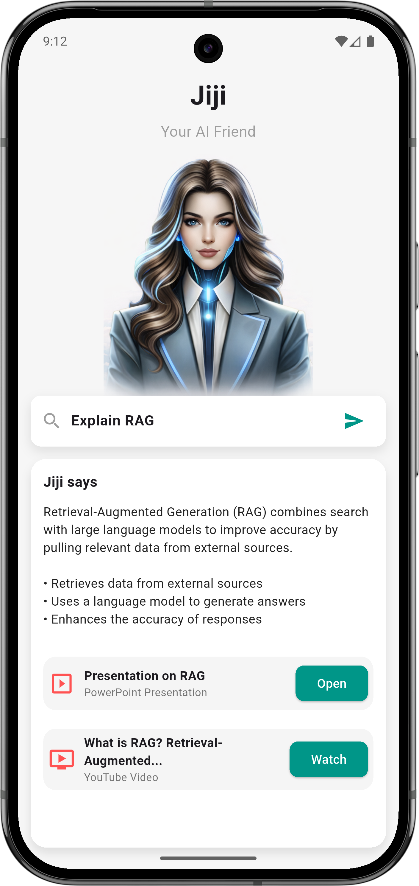

# 📱Learn with Jiji — Flutter Assignment

## Company: VeidaLabs

### About the company

VeidaLabs is building Learn with Jiji, an AI-driven learning companion that personalizes how professionals, founders, young adults, and teams learn about AI.
VeidaLabs serves: Corporates and Universities and plans to serve B2C users.
Learning content can include text, presentations (PPTs), images, session-recorded
videos, and AI-generated avatar videos.

## Project: Learn with Jiji — AI Learning Companion
Task: Implement the provided landing screen UI in Flutter.

## 🚀 Overview
This assignment implements a single landing screen for the Learn with Jiji app using Flutter.
The UI displays:

*   App name & description
*   AI avatar (Jiji)
*   Query input box with a send icon
*   Response section (generated by placeholder logic)
*   Resource/Reference cards

### 📁 Folder Structure

    lib/
    ├─ core/
    ├─ features/
    │  └─ jiji/
    │     ├─ data/
    │     ├─ domain/
    │     └─ presentation/
    │        ├─ bloc/
    │        ├─ pages/
    │        └─ widgets/
    └─ main.dart

## 🧠 State Management

This project uses the BLoC pattern for state management, with features including:

-   ✔ Loading state
-   ✔ Loaded state
-   ✔ Error state (with timestamp to re-trigger snackbars)

-   ✔ Clean event-to-state transitions

## 🎯 Features Delivered

*   ✔ UI matching the provided design
*   ✔ Scrollable response content
*   ✔ Fixed header and input area
*   ✔ Clean Architecture implementation
*   ✔ BLoC for separation of concerns
*   ✔ Snackbar for error handling
*   ✔ Keyboard-safe layout
*   ✔ Responsive UI using `MediaQuery`

## 📸 UI Reference

The UI is implemented based on the design image provided with the assignment.



## 🧬 Technical Stack

*   Flutter (3.35.3)
*   Dart
*   BLoC (`flutter_bloc`)
*   Equatable
*   Shimmer for loading effects
*   GitHub for version control

## ✅ Prerequisites

Before you begin, ensure you have the following installed:
-   Flutter SDK: 3.35.3 or compatible
-   Android Studio: 4.0 or higher
-   Android SDK: 34 or higher
-   Java JDK: 17 or higher

## 📦 Running the App

1.  **Clone the repository**
    ```bash
    git clone <https://github.com/Aayush0214/learn-with-jiji.git>
    cd <project_folder>
    ```

2.  **Install dependencies**
    ```bash
    flutter pub get
    ```

3.  **Run the app**
    ```bash
    flutter run
    ```

## 🧪 APK Build Guide

You can build the APK using the following commands:

-   **Debug APK:**
    ```bash
    flutter build apk --debug
    ```
    *Output path:* `build/app/outputs/flutter-apk/app-debug.apk`

-   **Release APK:**
    ```bash
    flutter build apk --release
    ```
    *Output path:* `build/app/outputs/flutter-apk/app-release.apk`

## 🧠 How AI Tools Helped

AI tools like ChatGPT and Gemini were used for:

-   Rapid UI breakdown and component planning.
-   README formatting and documentation.
-   Generating the avatar image.
-   Suggesting UX improvements like the keyboard-safe layout.
